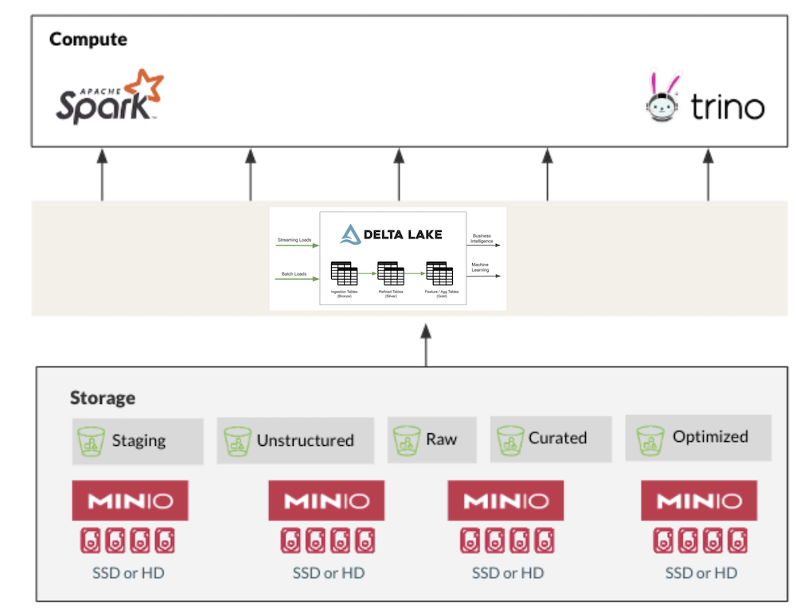

# Experient Data Platform 
A modern data stack for ingestion, processing, and data analytics using Minio, Trino, Spark, and Jupyter


## Architecture Layers




## Run Locally with Docker-compose


Build the entire data platform
```bash
docker-compose up -d
```

Query Engine Shell
```bash
docker container exec -it query-engine trino
```
Creating schemas through the query engine
```sql
CREATE SCHEMA minio.data_lake
WITH (location = 's3a://warehouse/');

CREATE TABLE minio.data_lake.companies
WITH (
    format = 'PARQUET',
    external_location = 's3a://warehouse/companies/'
) 
AS SELECT * FROM operational.business.organizations;
```
			
### Inpsecting Metadata
Log into the postgres container
```bash 
docker exec -it "postgres" psql -U admin -d "hive_db"
```
To inspect them metadata catalog 
```sql
SELECT * from "DBS";
```

Shutdown
```bash
docker-compose down
```
## Data Processing with Spark
Interactive Scala Shell

```bash
docker run -it spark /opt/spark/bin/spark-shell
```

Interactive Python Shell
```bash
docker run -it spark:python3 /opt/spark/bin/pyspark
```

